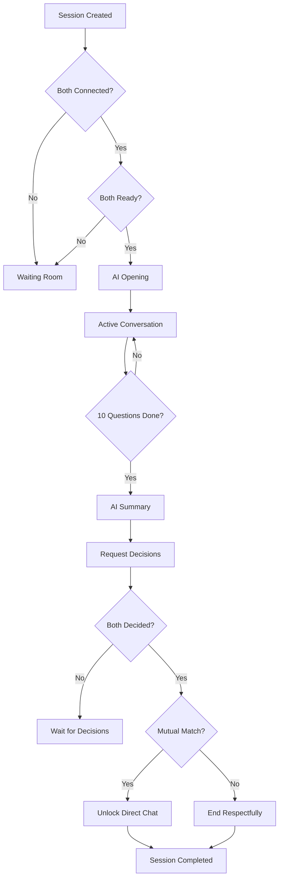

# WebSocket AI Moderator - Technical Documentation

## 🎙️ **Revolutionary Feature: AI Podcast Host for Dating**

DateNow is now the **world's first dating app** with a real-time AI moderator that acts like a professional podcast host, facilitating live conversations between matches using WebSocket technology and Google Gemini AI.

---

## 🌟 **What Makes This Revolutionary**

### **Traditional Dating Apps**
- Swipe → Match → Awkward first message
- No guidance or support
- High ghosting rates
- Superficial connections

### **DateNow's AI Moderator**
- Swipe → Match → **AI Podcast Host** → Guided Conversation → Mutual Decision → Direct Chat
- Professional moderation like a talk show
- Zero ghosting (both committed to conversation)
- Deep, meaningful connections
- Privacy-protected until mutual interest

---

## 🏗️ **System Architecture**

```
┌─────────────────┐         ┌─────────────────┐
│   User A        │         │   User B        │
│   (React)       │         │   (React)       │
└────────┬────────┘         └────────┬────────┘
         │                           │
         │    WebSocket (ws://)      │
         ├───────────┬───────────────┤
         │           │               │
         ▼           ▼               ▼
    ┌────────────────────────────────────┐
    │   WebSocket Connection Manager     │
    │   (ConnectionManager)              │
    └────────────────┬───────────────────┘
                     │
         ┌───────────┴───────────┐
         │                       │
         ▼                       ▼
┌────────────────────┐  ┌───────────────────┐
│ Session Manager    │  │  AI Moderator     │
│ (ConversationSession) │  │  (Gemini 1.5 Pro) │
└────────────────────┘  └───────────────────┘
         │                       │
         ▼                       ▼
┌────────────────────┐  ┌───────────────────┐
│ Privacy Controls   │  │ Question Generator│
│ Message Filtering  │  │ Insight Engine    │
└────────────────────┘  └───────────────────┘
```

---

## 📡 **WebSocket Implementation**

### **Connection Flow**

```typescript
// Frontend Connection
const ws = new WebSocket('ws://localhost:8000/ws/conversation/123?token=JWT_TOKEN')

// Backend Handling
@router.websocket("/conversation/{match_id}")
async def conversation_websocket(
    websocket: WebSocket,
    match_id: int,
    token: str
)
```

### **Message Protocol**

All messages are JSON:

```json
{
  "type": "message_type",
  "data": { /* ... */ },
  "timestamp": "2024-01-01T12:00:00Z"
}
```

### **Message Types**

#### **Client → Server**
```typescript
// User ready to start
{ "type": "ready" }

// User response
{
  "type": "message",
  "content": "I love hiking and photography!"
}

// Typing indicator
{ "type": "typing" }

// Final decision
{
  "type": "decision",
  "decision": true  // or false
}
```

#### **Server → Client**
```typescript
// Session state update
{
  "type": "session_state",
  "session": { /* session object */ },
  "messages": [ /* message array */ ]
}

// Conversation started
{
  "type": "conversation_started",
  "message": { /* AI greeting */ },
  "session": { /* updated session */ }
}

// New message
{
  "type": "message",
  "message": {
    "id": "uuid",
    "type": "moderator_question",
    "content": "@Sarah: What do you value most in a relationship?",
    "sender_name": "AI Moderator",
    "timestamp": "2024-01-01T12:00:00Z"
  }
}

// Typing indicator
{
  "type": "typing",
  "user_name": "John"
}

// Wrapping up
{
  "type": "conversation_wrapping_up",
  "message": { /* summary message */ },
  "summary": {
    "key_connections": [...],
    "potential_challenges": [...],
    "recommendation": "proceed"
  },
  "request_decision": true
}

// Conversation ended
{
  "type": "conversation_ended",
  "is_mutual_match": true,
  "user1_decision": true,
  "user2_decision": true,
  "message": "🎉 It's a match!",
  "can_chat_directly": true
}
```

---

## 🤖 **AI Moderator Service**

### **Personality & Style**

The AI Moderator is designed to be:
- **Warm & Professional**: Like a friendly podcast host
- **Insightful**: Makes meaningful observations
- **Balanced**: Equal time for both users
- **Encouraging**: Supportive and positive
- **Curious**: Genuinely interested in responses

### **Question Generation**

The AI uses context-aware prompting:

```python
prompt = f"""
You are a professional dating conversation moderator.

PARTICIPANTS:
- {user1_name} (Person A)
- {user2_name} (Person B)
- Compatibility Score: {compatibility_score:.0%}

YOUR STYLE:
✓ Warm and professional podcast host
✓ Ask thoughtful questions that reveal personality
✓ Make insightful observations
✓ Create comfortable atmosphere

CURRENT STAGE: {stage}
QUESTIONS ASKED: {count}/10

Generate ONE question for ONE person that:
1. Builds on previous responses
2. Explores values or life goals
3. Feels conversational, not like an interview
4. Indicates who should respond: @{name}
"""
```

### **Conversation Stages**

```python
class SessionStage(Enum):
    WAITING = "waiting"          # Waiting for both users
    OPENING = "opening"           # AI greeting
    ACTIVE = "active"             # Questions & answers
    WRAPPING_UP = "wrapping_up"  # Final summary
    COMPLETED = "completed"       # Session ended
```

### **AI Capabilities**

1. **Opening Greeting**
   ```python
   await moderator.start_conversation(
       match, user1, user2, profiles...
   )
   ```
   Generates warm welcome and first question

2. **Process Responses**
   ```python
   await moderator.process_user_response(
       user_response, user_name, other_name, history...
   )
   ```
   Acknowledges answer, makes observation, asks next question

3. **Generate Summary**
   ```python
   await moderator.generate_conversation_summary(
       history, names, compatibility...
   )
   ```
   Creates final compatibility report with recommendations

4. **Real-time Insights**
   ```python
   await moderator.generate_insight(snippet, "connection")
   ```
   Makes observations during conversation

---

## 🔐 **Privacy & Security**

### **Privacy Controls**

1. **Name Privacy**
   ```python
   user1_can_see_name: bool = False
   user2_can_see_name: bool = False
   ```
   Names hidden until mutual match

2. **Message Filtering**
   ```python
   def get_messages_for_user(self, user_id: int):
       # Filter messages based on privacy settings
       if not can_see_name:
           sender_name = "Your Match"
   ```

3. **Session Isolation**
   - Each match has its own session
   - No cross-session message leakage
   - Auto-cleanup on expiration

### **Security Features**

1. **JWT Authentication**
   ```python
   user = await get_user_from_token(token, db)
   ```

2. **Match Verification**
   ```python
   if user.id not in [match.user1_id, match.user2_id]:
       await websocket.close(code=1008)
   ```

3. **Session Expiration**
   ```python
   expires_at = datetime.utcnow() + timedelta(hours=2)
   ```

4. **Auto-cleanup**
   ```python
   @router.on_event("startup")
   async def cleanup_task():
       while True:
           await asyncio.sleep(300)  # Every 5 min
           session_manager.cleanup_expired_sessions()
   ```

---

## 📊 **Conversation Session Management**

### **Session Data Structure**

```python
@dataclass
class ConversationSession:
    session_id: str
    match_id: int
    user1_id: int
    user2_id: int
    user1_name: str
    user2_name: str
    compatibility_score: float

    # State
    stage: SessionStage
    messages: List[ConversationMessage]
    questions_asked: int = 0
    max_questions: int = 10

    # Connection status
    user1_connected: bool = False
    user2_connected: bool = False
    user1_ready: bool = False
    user2_ready: bool = False

    # Privacy
    user1_can_see_name: bool = False
    user2_can_see_name: bool = False

    # Decisions
    user1_decision: Optional[bool] = None
    user2_decision: Optional[bool] = None

    # Timing
    created_at: datetime
    started_at: Optional[datetime]
    ended_at: Optional[datetime]
    expires_at: datetime
```

### **Message Structure**

```python
@dataclass
class ConversationMessage:
    id: str                    # UUID
    type: MessageType          # Enum
    content: str               # Message text
    sender_id: Optional[int]   # None for AI
    sender_name: Optional[str] # Display name
    timestamp: datetime        # When sent
    metadata: Dict             # Extra data
```

### **Session Lifecycle**



---

## 🎨 **Frontend UI Components**

### **Waiting Room**

```tsx
<div className="waiting-room">
  <UsersIcon className="animate-spin" />
  <h2>Waiting for Your Match</h2>

  {bothConnected && (
    <button onClick={handleReady}>
      I'm Ready to Start
    </button>
  )}
</div>
```

### **Message Bubble**

```tsx
<motion.div
  initial={{ opacity: 0, y: 20 }}
  animate={{ opacity: 1, y: 0 }}
  className={isAI ? 'ai-message' : 'user-message'}
>
  <div className="sender-name">
    {isAI && <BotIcon />}
    {message.sender_name}
  </div>
  <div className="content">
    {message.content}
  </div>
  <div className="timestamp">
    {formatTime(message.timestamp)}
  </div>
</motion.div>
```

### **Typing Indicator**

```tsx
{otherUserTyping && (
  <motion.div className="typing-indicator">
    <motion.div animate={{ y: [0, -5, 0] }} />
    <motion.div animate={{ y: [0, -5, 0] }} delay={0.2} />
    <motion.div animate={{ y: [0, -5, 0] }} delay={0.4} />
    <span>Typing...</span>
  </motion.div>
)}
```

### **Decision UI**

```tsx
<div className="decision-prompt">
  <p>Would you like to continue getting to know this person?</p>
  <div className="decision-buttons">
    <button onClick={() => handleDecision(true)}>
      <HeartIcon />
      Yes, Continue
    </button>
    <button onClick={() => handleDecision(false)}>
      <XIcon />
      No Thanks
    </button>
  </div>
</div>
```

### **Match Result**

```tsx
{isMutualMatch ? (
  <div className="match-celebration">
    <HeartIcon className="pulse" />
    <h1>It's a Match! 🎉</h1>
    <p>You both want to continue!</p>
    <button>Start Chatting</button>
  </div>
) : (
  <div className="no-match">
    <CheckIcon />
    <h1>Thank You for Participating</h1>
    <p>We'll find the right match for you!</p>
    <button>Find More Matches</button>
  </div>
)}
```

---

## 🔄 **Conversation Flow Example**

### **Complete Session Flow**

```
1. Both users connect to WebSocket
   → Status: WAITING

2. Both click "I'm Ready"
   → Status: OPENING

3. AI Moderator:
   "Hi Sarah and John! Welcome to your AI-moderated conversation.
    I'm here to help you get to know each other authentically.
    @Sarah: Let's start with you - what do you love to do in your free time?"
   → Status: ACTIVE
   → Questions: 1/10

4. Sarah responds:
   "I love hiking and photography! I try to get out to national parks
    whenever I can."

5. AI Moderator:
   "That's wonderful, Sarah! Sounds like you have a real passion for nature.
    @John: How do you like to spend your weekends?"
   → Questions: 2/10

6. John responds:
   "I'm big into fitness and cooking. I love trying new recipes!"

7. AI Moderator:
   "Great! I notice you both value active lifestyles.
    @Sarah: What's your ideal first date look like?"
   → Questions: 3/10

... continues for 10 thoughtful questions ...

10. AI Moderator (after question 10):
    "Thank you both for this wonderful conversation!

    Based on our discussion, I've observed:

    ✨ Key Connections:
    • Both value outdoor activities and adventure
    • Shared interest in health and wellness
    • Similar communication styles - authentic and open

    💭 Things to Consider:
    • Different approaches to work-life balance
    • May need to align on long-term location preferences

    🎯 My Recommendation: Proceed

    Now it's time for you both to decide if you'd like to continue
    getting to know each other."
    → Status: WRAPPING_UP

11. Sarah clicks "Yes, Continue"
    John clicks "Yes, Continue"
    → Status: COMPLETED

12. Result:
    "🎉 It's a Match! You can now chat directly."
    → Unlock direct messaging
```

---

## 📈 **Performance & Scalability**

### **WebSocket Optimization**

1. **Connection Pooling**
   - Reuse connections when possible
   - Automatic reconnection on drop

2. **Message Queuing**
   - Queue messages if connection drops
   - Deliver when reconnected

3. **Load Balancing**
   - Distribute sessions across servers
   - Session affinity for WebSocket

### **AI Response Optimization**

1. **Streaming Responses**
   ```python
   async for chunk in moderator.generate_streaming_response(prompt):
       await websocket.send_json({
           'type': 'ai_chunk',
           'chunk': chunk
       })
   ```

2. **Caching**
   - Cache common question templates
   - Reuse personality prompts

3. **Gemini API Management**
   - Rate limiting
   - Token optimization
   - Fallback to simpler models if needed

---

## 🧪 **Testing**

### **WebSocket Testing**

```python
# Test connection
async def test_websocket_connection():
    async with client.websocket_connect("/ws/conversation/1?token=TOKEN") as ws:
        # Test ready message
        await ws.send_json({"type": "ready"})
        response = await ws.receive_json()
        assert response["type"] == "user_ready"
```

### **AI Moderator Testing**

```python
# Test question generation
def test_question_generation():
    question = await moderator.start_conversation(...)
    assert "@" in question  # Should mention a user
    assert len(question) > 20  # Should be substantial
```

### **Session Management Testing**

```python
# Test session lifecycle
def test_session_lifecycle():
    session = session_manager.create_session(...)
    assert session.stage == SessionStage.WAITING

    session.user1_ready = True
    session.user2_ready = True
    assert session.can_start()
```

---

## 📱 **Mobile Considerations**

### **WebSocket on Mobile**

1. **Connection Management**
   - Auto-reconnect on app resume
   - Handle background state
   - Ping/pong for keep-alive

2. **Battery Optimization**
   - Close connections when inactive
   - Use efficient message formats

3. **Network Handling**
   - WiFi ↔ Cellular transitions
   - Retry logic for poor connections

---

## 🚀 **Deployment**

### **Backend Requirements**

```yaml
# docker-compose.yml
services:
  backend:
    environment:
      - GEMINI_API_KEY=${GEMINI_API_KEY}
    ports:
      - "8000:8000"
```

### **Environment Variables**

```bash
# .env
GEMINI_API_KEY=your_gemini_api_key
WS_MESSAGE_QUEUE_SIZE=100
WS_HEARTBEAT_INTERVAL=30
AI_SESSION_TIMEOUT_MINUTES=60
```

### **Production Checklist**

- [ ] SSL/TLS for WebSocket (wss://)
- [ ] Horizontal scaling with session affinity
- [ ] Redis for session state (optional)
- [ ] Monitoring & logging
- [ ] Rate limiting on Gemini API
- [ ] Fallback AI model
- [ ] Connection timeout handling

---

## 🎯 **Key Metrics to Track**

1. **Engagement**
   - Average session duration
   - Questions completed per session
   - Response times

2. **Quality**
   - Mutual match rate
   - AI response relevance
   - User satisfaction scores

3. **Technical**
   - WebSocket connection success rate
   - Message delivery time
   - AI response latency
   - Session completion rate

---

## 🏆 **What Makes This Revolutionary**

### **Industry First**

1. **Real-Time AI Moderation** - No other dating app has this
2. **Podcast Host Style** - Engaging, professional facilitation
3. **Privacy-First** - Names hidden until mutual interest
4. **Zero Ghosting** - Both committed to full conversation
5. **Structured Flow** - 10 thoughtful questions, not endless chat
6. **Instant Decision** - Yes/No after conversation, no waiting

### **User Benefits**

- **No awkward first messages** - AI handles introduction
- **Meaningful conversations** - Guided by professional moderator
- **Efficient** - 10 questions reveal compatibility
- **Private** - Identity protected until mutual interest
- **Fair** - Equal time for both users
- **Insightful** - AI provides relationship observations

### **Technical Innovation**

- **WebSocket** - Real-time, bidirectional communication
- **Gemini AI** - State-of-the-art language model
- **Session Architecture** - Privacy and scalability
- **Dual-Session** - Separate experience for each user
- **Auto-alternation** - Fair question distribution

---

## 🎊 **Result**

**The world's most advanced AI-moderated dating platform** where technology enhances human connection through:

✅ **Professional AI Moderation** (Podcast Host Style)
✅ **Real-Time WebSocket Communication**
✅ **Privacy-Protected Conversations**
✅ **Structured 10-Question Format**
✅ **Mutual Decision System**
✅ **Seamless Transition to Direct Chat**
✅ **Zero Ghosting Guarantee**
✅ **Meaningful Connections**

**Built with 💙 by professional engineers for meaningful human relationships**

---

## 📞 **Support & Resources**

- **API Docs**: http://localhost:8000/docs
- **WebSocket Endpoint**: ws://localhost:8000/ws/conversation/{match_id}
- **Frontend Route**: /live-conversation/{matchId}

---

**Welcome to the future of dating! 🚀**
