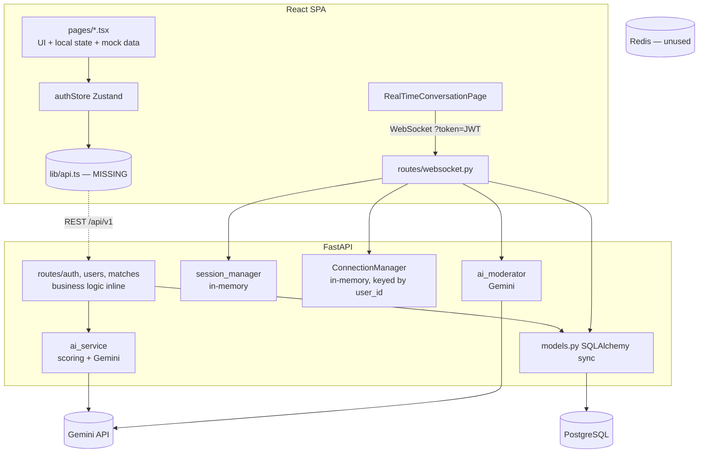
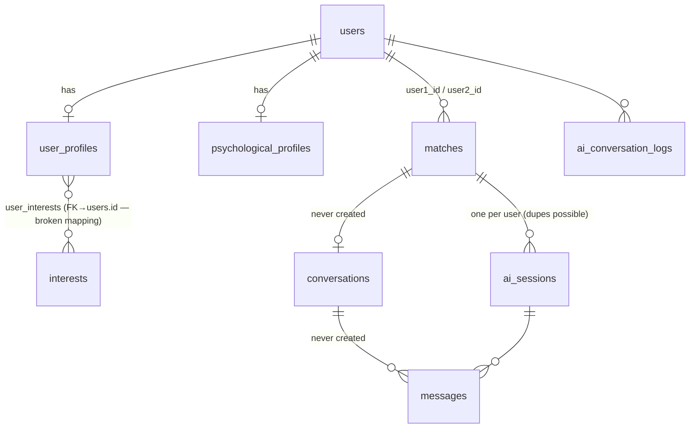

# DATENOW AI — REPOSITORY ASSESSMENT

Assessment date: 2026-09-24 · Commit assessed: `1103f21` (5 commits, all 2025-11-23)
Method: every source file was read in full; claims marked **[verified]** were reproduced by
executing the code (backend on Python 3.11 with pinned deps + SQLite + stubbed Gemini;
frontend `npm install` + `tsc`). Claims marked **[code-read]** come from reading the code only.

---

## 1. Executive Summary

**The repository is not a Flutter project.** It is a **FastAPI (Python) backend + React/Vite/TypeScript
web frontend**, run via docker-compose with PostgreSQL and Redis. No Dart, Flutter, iOS or Android code
exists. All Flutter-specific checks in the brief (`flutter analyze`, `flutter test`, …) are not applicable;
the equivalent Python/TypeScript checks were run instead.

The codebase is small (~6,000 lines of code, ~2,500 lines of markdown) and was produced in a single day
across 5 commits. It is a **prototype that has never run end-to-end in its committed state**:

| Layer | State |
|---|---|
| Backend | **Does not start.** Three independent fatal bugs (model import crash, broken ORM relationship, JWT decode rejecting every token). With those three patched in a scratch copy, the core REST flow (register → profile → psych profile → suggestions → mutual accept → AI Q&A) works. |
| Frontend | **Does not build or render.** The API client module `src/lib/api.ts` was never committed (the root `.gitignore` rule `lib/` excluded it), so the app root fails to import. `tsc` reports 13 errors. |
| Tests / CI / migrations | None. |
| Product | A sound *concept skeleton* of the target (psych profile → compatibility score → mutual interest → AI-moderated live session → yes/no) exists, but consent, safety, privacy and persistence are missing or bypassable. |

The docs (`README.md`, `IMPLEMENTATION_SUMMARY.md`, `WEBSOCKET_AI_MODERATOR.md`) describe a more
complete system than exists. Treat them as design intent, not as a description of what works.

**Worth keeping:** the data model core (User / UserProfile / PsychologicalProfile / Match), the
IPIP-based questionnaire content and its server-side scorer (`questionnaire_processor.py`, currently
never called), the deterministic personality/values scoring functions, the WebSocket session concept, and
the UI visual language. **Maturity: early prototype (pre-alpha).** The safest path is to stabilise and harden
what exists, not to rewrite it.

---

## 2. Repository Structure

```
DateNow/
├── backend/                         FastAPI service (Python 3.11)
│   ├── app/
│   │   ├── main.py                  App factory, CORS, router registration, create_all on startup
│   │   ├── config.py                pydantic-settings env config
│   │   ├── database.py              Sync SQLAlchemy engine/session, create_all
│   │   ├── models.py                All ORM models + enums (single file)
│   │   ├── schemas.py               All Pydantic request/response schemas
│   │   ├── auth.py                  bcrypt hashing, JWT create/decode, get_current_user
│   │   ├── ai_service.py            Gemini calls + deterministic compatibility math (mixed)
│   │   ├── ai_moderator.py          Gemini "podcast host" moderator prompts
│   │   ├── conversation_session.py  In-memory live-session state (dataclasses)
│   │   ├── websocket_manager.py     In-memory WS connection registry (keyed by user_id)
│   │   ├── questionnaire_processor.py  Server-side questionnaire scoring — UNUSED
│   │   └── routes/ auth.py users.py matches.py websocket.py
│   ├── seed_data.py                 Seeds interests + 2 prompt templates (templates never read)
│   ├── requirements.txt, Dockerfile, .env.example
├── frontend/                        React 18 + Vite 5 + TS (strict) + Tailwind
│   └── src/
│       ├── main.tsx, App.tsx        Router + QueryClientProvider
│       ├── store/authStore.ts       Zustand auth store (imports missing ../lib/api)
│       ├── data/questionnaireData.ts  ~55 questions in 8 sections (+2 verification questions)
│       ├── components/QuestionnaireQuestion.tsx
│       └── pages/  EnhancedLandingPage, LandingPage (dead), LoginPage, RegisterPage,
│                   EnhancedOnboardingPage, OnboardingPage (dead), DashboardPage,
│                   MatchesPage (mock), AIConversationPage (mock), RealTimeConversationPage
├── docker-compose.yml               postgres:15, redis:7, backend (reload), frontend (vite dev)
└── README.md, DEVELOPMENT.md, DEPLOYMENT.md, IMPLEMENTATION_SUMMARY.md, WEBSOCKET_AI_MODERATOR.md
```

Absent: `test/`, `tests/`, CI config, Alembic migrations dir, ESLint config, `vite-env.d.ts`,
`src/lib/`, mobile/desktop targets.

---

## 3. Technology Stack (confirmed)

| Concern | Technology | Notes |
|---|---|---|
| Backend framework | FastAPI 0.104.1, Uvicorn 0.24 | async handlers calling **sync** DB + **sync** Gemini SDK (blocks event loop) |
| ORM / DB | SQLAlchemy 2.0.23 (legacy declarative, sync), PostgreSQL 15 | schema via `create_all`; Alembic installed but **not configured** |
| Cache | Redis 7 | configured in compose + settings, **never used** |
| Auth | python-jose (HS256 JWT), passlib[bcrypt] | access 30 min / refresh 7 d; refresh endpoint is a stub |
| Validation | Pydantic 2.5 (v1-style `@validator` still used) | |
| AI | `google-generativeai` 0.3.1; models `gemini-pro` (config) and hard-coded `gemini-1.5-pro` (moderator) | both model IDs and this SDK generation are very likely retired/deprecated by now — **unverified** (no key available); treat as broken until proven |
| Realtime | FastAPI WebSockets; state in process memory | single-process only; lost on restart |
| Frontend | React 18, Vite 5, TypeScript 5 strict, React Router 6, Tailwind 3, framer-motion, lucide-react | |
| Client state | Zustand (auth only) | TanStack Query provider mounted but no queries exist |
| Networking | axios (intended, in missing `lib/api.ts`) | |
| Forms | react-hook-form + zod installed, **unused** | |
| Unused deps | `openai`, `aioredis` (deprecated), `asyncpg`, `fastapi-cors` (not needed; FastAPI ships CORS), duplicate `httpx` pin | |
| Storage / media | none (no upload endpoint; photo UI is decorative) | |
| Push, analytics, crash reporting, payments, feature flags | none | |
| DI | module-level singletons (`ai_service`, `moderator`, `manager`, `session_manager`) | |
| Tests | pytest/pytest-asyncio installed; **0 tests**. Frontend has no test runner or `test` script | |
| Build flavours / env | `.env` files; compose `ENVIRONMENT=development` | frontend Dockerfile runs the Vite **dev server** (not a prod build) |
| CI/CD | none | |

---

## 4. Architecture

Backend is **layer-first with fat route handlers** — no domain or repository layer. Business rules
(eligibility filtering, match state transitions, session completion) live inside route functions;
`AIService` mixes deterministic scoring with LLM calls.



Deviations from the target shape (UI → state → domain → repository → data source):
- No domain layer; no repositories; ORM queries in handlers.
- **Two parallel "AI session" systems** that do not know about each other:
  1. *Async REST Q&A* (`AISession`, persisted): each user separately answers 10 AI questions; the AI
     then writes a joint report. The frontend page for it (`AIConversationPage`) is fully mocked.
  2. *Live WebSocket moderated session* (in-memory `ConversationSession`): both users + AI moderator in
     real time, ending with a yes/no decision. It is the closest match to the target "AI-moderated
     introduction", but none of it is persisted.
- Frontend: page-centric, no API layer (lost), no typed API models, mock data inside pages.

---

## 5. Implemented Features (verified working *after* patching the 3 fatal bugs)

None are working **as committed**. With the fatal bugs patched in a scratch copy:

- Registration and login with bcrypt-hashed passwords, JWT issuance **[verified]**
- Profile creation and update API **[verified]**
- Psychological profile creation API (takes pre-computed scores) with an AI-written narrative **[verified with stubbed AI]**
- Deterministic Big Five + values compatibility maths **[verified]**
- Match suggestions with gender (one-directional) filter + threshold, persisted as `Match` **[verified]**
- Accept/reject actions; mutual accept → `ai_mediation` + AI sessions created **[verified]**
- Async AI question/answer loop, persisted in `AISession.session_data` **[verified]**
- Live WebSocket session: connect, ready, AI opening, turn responses, wrap-up summary, decisions → match
  status `direct_chat`/`rejected` **[verified connect/ready; rest code-read]**

## 6. Partially Implemented Features

| Feature | Exists | Missing |
|---|---|---|
| Onboarding | Polished multi-step UI with 55 questions; server scorer in `questionnaire_processor.py` | **No API calls at all** — nothing is persisted; scorer never invoked; final "interests" step has no render branch → blank screen **[code-read]**; relationship goal and age prefs (required by the API) not collected; only male/female offered though API enum has 4 values |
| Auth | register/login | refresh (`pass` → 500 **[verified]**), logout server-side, email verification (`is_verified` never set), password reset, 401 handling in client |
| Matching | score functions, suggestions endpoint | age filter, reciprocal gender, relationship intent, distance, blocks, deal-breakers; interests score hard-coded `0.75`, lifestyle includes a hard-coded `+0.5` placeholder |
| Interests | table, seed, set/get endpoints | not in onboarding UI; not used by scoring |
| Live AI session | WS flow end-to-end | persistence, consent gating, reconnect, turn enforcement, multi-process support, cleanup task (never runs) |
| Direct chat | `Conversation`, `Message` tables | never written or read by any code; no endpoints; the UI's "Start Chatting" navigates to a route that doesn't exist |

## 7. Mock / Placeholder Functionality (looks real in the UI, isn't)

| Where | What |
|---|---|
| `MatchesPage.tsx:9` | Hard-coded "Sarah, 28" / "Emily, 26" matches; buttons do nothing |
| `AIConversationPage.tsx` | Canned question, canned "insight", no backend; `matchId` unused |
| `EnhancedOnboardingPage.tsx` photos step | 6 decorative tiles; no upload; "Add at least 2 photos" not enforced |
| Onboarding "complete" screen | Says "Our AI is now finding compatible matches" — nothing was saved |
| `DashboardPage.tsx` | "Edit Profile" links back to `/dashboard` |
| `EnhancedLandingPage.tsx` footer | Privacy/Terms/Safety/Pricing links are `href="#"` |
| `ai_service.py:230, 247` | Interests score `0.75` and lifestyle `+0.5` placeholders feed the displayed compatibility % |
| `ai_service.py:147`, `ai_moderator.py:220` | On AI parse failure, **fabricated** generic strengths / "recommendation: proceed" are shown as if they were real analysis |
| `seed_data.py` / `AIPromptTemplate` | Prompt templates seeded but never read; real prompts are hard-coded |
| `OnboardingPage.tsx`, `LandingPage.tsx` | Dead pages (unrouted) |

## 8. Broken Functionality (with evidence)

| # | Issue | Location | Evidence |
|---|---|---|---|
| B1 | Backend cannot import: column named `metadata` is reserved by SQLAlchemy Declarative | `backend/app/models.py:288` | **[verified]** `InvalidRequestError: Attribute name 'metadata' is reserved` |
| B2 | Every ORM query fails: `UserProfile.interests` many-to-many uses `user_interests.user_id → users.id`, not `user_profiles.id`, so mappers can't configure | `models.py:55-60, 127, 139` | **[verified]** `NoForeignKeysError … UserProfile.interests` on the first query |
| B3 | Every authenticated request → 401: tokens are issued with integer `sub`; python-jose requires a string | `routes/auth.py:47,48,74,75` | **[verified]** `JWTClaimsError: Subject must be a string` |
| B4 | `/auth/refresh` returns `None` → 500 | `routes/auth.py:84-89` | **[verified]** |
| B5 | Frontend API client never committed; the whole app fails to load | `.gitignore:13` (`lib/`) ignores `frontend/src/lib/`; `store/authStore.ts:5` | **[verified]** `git check-ignore` + `tsc` TS2307 |
| B6 | `npm run build` fails: 13 TypeScript errors (unused locals, missing `vite-env.d.ts`, `NodeJS` namespace) | several pages | **[verified]** |
| B7 | `npm run lint` can't run: no ESLint config | `frontend/` | **[verified]** |
| B8 | Onboarding dead-ends on a blank screen after the last question (`'interests'` step not rendered) | `EnhancedOnboardingPage.tsx:81` | [code-read] |
| B9 | Repeating `accept` creates duplicate AI sessions (4 rows for one match) | `routes/matches.py:196-214` | **[verified]** |
| B10 | Rejected match can be re-opened by sending `accept` again | `routes/matches.py:181-198` | **[verified]** |
| B11 | Suggestions ignore age preferences and reciprocal gender preference | `routes/matches.py:66-70` | **[verified]**: a 45-year-old seeking only women was recommended to a man filtering for 25–30 |
| B12 | Session cleanup task never runs (router `on_event` is ignored when the app uses `lifespan`; if it ran, its infinite loop would block startup) | `routes/websocket.py:389` | [code-read]; app startup completing is consistent |
| B13 | Live UI renders *both* participants' messages as "mine" (right-aligned) | `RealTimeConversationPage.tsx:449-450` | [code-read] |
| B14 | Live session unreachable from UI (no link to `/live-conversation/:id`); post-match "Start Chatting" goes to a nonexistent route | `App.tsx`, `RealTimeConversationPage.tsx:198` | [code-read] |
| B15 | An AI outage blocks onboarding: `create_psychological_profile` awaits Gemini before committing; any exception → 500, and the profile is lost | `routes/users.py:139-148` | [code-read] |
| B16 | Gemini model IDs / SDK likely retired | `config.py:33`, `ai_moderator.py:27` | unverified (no key) |
| B17 | Sync Gemini + sync DB calls inside `async def` block the event loop; one slow LLM call stalls every user, including all WebSockets | `ai_service.py`, `ai_moderator.py`, all routes | [code-read] |

## 9. AI Architecture

Provider: Gemini only, called directly via SDK singletons (`genai.configure` at import time). No
abstraction, retries, timeouts, rate limits, cost tracking or output schema validation. **The client
holds no AI secret** (good) — all calls are server-side.

| Capability | Input → Prompt | Output handling | Storage / consumer | Issues |
|---|---|---|---|---|
| `analyze_psychological_profile` | all psych scores → f-string prompt | free text, unvalidated | `PsychologicalProfile.ai_insights`; returned to owner | blocks profile creation on failure |
| `calculate_compatibility` | both users' psych data + scores → "Format as JSON" | `json.loads` after stripping fences; **bare `except:` → fabricated fallback** | `Match.compatibility_report`, `ai_recommendation` | called for up to 2×limit candidates **sequentially per GET** (cost amplification) |
| `generate_conversation_question` | first name, gender, goal, styles, **full prior Q&A** | raw text | `AIConversationLog` (**full prompt + PII stored in plaintext, no retention**) | token count = word count |
| `analyze_conversation_response` | client-supplied question + answer | raw text | `AISession.user_insights` | question text is **client-forgeable** **[verified]** |
| `generate_compatibility_report` | **both users' private Q&A and insights** | raw text | `Match.compatibility_report`, visible to both | **can reveal one user's private answers to the other** |
| Moderator `start_conversation` / `process_user_response` | names + last 6 messages; user text interpolated verbatim | raw text | in-memory only | **prompt injection**: a participant can steer what the moderator says to the other person |
| Moderator `generate_conversation_summary` | **entire transcript** (unbounded) | JSON parse, bare `except:` → fabricated "proceed" | shown to both | fabricated recommendations |
| `generate_conversation_starter`, `generate_icebreaker_question`, `generate_insight`, `generate_streaming_response`, `detect_conversation_readiness` | — | — | — | dead code |

AI is used as a **source of truth in places it shouldn't be**: fallback text is presented as analysis,
and the recommendation feeds the user decision UI unqualified ("🎯 My Recommendation: Proceed").

## 10. Backend Architecture

- **Auth:** email + password; HS256 JWT bearer tokens; tokens stored in `localStorage` (XSS-exposed) and
  passed to the WebSocket in the query string (ends up in access logs). No refresh, no revocation, no
  email verification, no password reset, no rate limiting.
- **Authorization:** per-handler checks that the caller is a match participant (REST) — correct for
  reads. The **WebSocket checks membership but not match status** (see Security C1).
- **Database:** PostgreSQL via sync SQLAlchemy; schema created by `create_all` at startup (no migrations,
  so schema changes cannot be rolled out safely). `DEBUG=True` default → `echo=True` logs every SQL
  statement with parameters (PII in logs).
- **Storage:** none.
- **Realtime:** single-process in-memory registries; one socket per user; session looked up **by user,
  not by match**.
- **Background work:** none effective.

## 11. Current Data Model



| Entity | Key fields | Privacy notes |
|---|---|---|
| `users` | email (unique), hashed_password, is_active, is_verified (never set), last_login | |
| `user_profiles` | names, **date_of_birth (no 18+ server check)**, gender, bio, city/country, **lat/long (precise; unused)**, height, looking_for_gender (JSON), age prefs, distance pref, relationship_goal, photos (JSON URLs, never set) | no visibility controls per field |
| `interests` / `user_interests` | name, category | mapping bug B2 |
| `psychological_profiles` | Big Five, 5 values, comm/conflict style, 5 love languages, attachment style, `questionnaire_responses` (JSON raw answers), `ai_insights` | sensitive; raw answers and normalised scores both stored (good separation, but raw never populated) |
| `matches` | user1/user2, status enum, 5 compatibility floats, report, recommendation, per-user interest flags, timestamps | no uniqueness on (user1, user2) pair; no ordering convention → A↔B and B↔A both possible |
| `ai_sessions` | match, user, status, counts, `session_data` (Q&A JSON), insights | |
| `conversations`, `messages` | exist; unused | `messages.metadata` is the crash in B1 |
| `ai_prompt_templates` | seeded; unused | |
| `ai_conversation_logs` | full prompt + response, model, fake token count | plaintext PII, no retention |
| *(in-memory)* `ConversationSession`, `ConversationMessage` | full live transcript | lost on restart; never audited |

**Missing entities for the target product:** Block, Report, Feedback, persisted IntroductionSession +
SessionParticipant + SessionEvent, Recommendation (candidate shown ≠ match), Photo/Media, per-field
Visibility/Consent, OnboardingAnswer (versioned raw answers), Verification, RefreshToken/Device,
Subscription/Entitlement, Notification, AuditLog, AIRequest (cost/latency telemetry).

## 12. Matching System Assessment

Pipeline today: `GET /matches/suggestions` →
1. exclude self + anyone with an existing match row
2. filter `gender IN my looking_for_gender` (one-directional)
3. take `limit*2` rows (arbitrary DB order)
4. for each: N+1 query for psych profile; deterministic scores; **one Gemini call each**
5. if overall ≥ 0.7 → **insert a `Match` row (a GET with side effects)**

Deterministic scoring (`ai_service.py:164-249`): personality (similarity on O/A/C, "complementary"
20–40-point band on E/N with a 0.7 floor), values (1 − |Δ|/100), interests (constant 0.75),
lifestyle (0.5 for same goal + constant 0.5). Weights 0.3/0.3/0.2/0.2. The formulas are reasonable
starting heuristics but are **not unit-tested, not separated from the LLM code, and 35% of the weight is
placeholder**. Candidates are never shown to users as profiles: `MatchResponse` returns only user IDs,
so the UI has no way to display who a match is.

Verdict: a seed of the target hybrid pipeline (hard filters → deterministic score → AI explanation) is
present in shape, but hard filters are incomplete, the LLM is on the hot path for *every* candidate, and
recommendation vs. match vs. consent are conflated into one row.

## 13. Chat / Session Assessment

- **Direct messaging:** not implemented (tables only).
- **Async AI Q&A (REST):** works server-side after the fixes; UI is a mock. Its purpose (the AI
  interviewing each user separately) overlaps with onboarding and with the live session.
- **Live AI-moderated session (WS):** the most valuable prototype. Stages exist
  (`waiting → opening → active → wrapping_up → completed/cancelled`), but the stage lives only in memory,
  there's no turn enforcement (either user can talk at any time; each message triggers a Gemini call), no
  moderation of user content, no report/leave action, no reconnect story, no persistence of the
  transcript or outcome other than the final match status, and privacy fields (`*_can_see_name`) are dead
  code (`messages_visible_to_both` is always `True`).

## 14. Security Findings

| Sev | Finding | Location | Action |
|---|---|---|---|
| **CRITICAL** | **Mutual consent bypass**: the live AI session opens on any match the user is part of, regardless of status. Because suggestions create a `Match` immediately, a user can pull any recommended person into a live session that neither side accepted. **[verified on a `pending` match]** | `routes/websocket.py:63-71` | Gate on `status == AI_MEDIATION` (and later on a persisted session in `WAITING`) |
| **CRITICAL** | **No server-side 18+ enforcement.** Only an HTML `max` attribute on the date input. | `schemas.py:40`, `routes/users.py:36` | Validate age ≥ 18 server-side; block matching for ineligible users |
| HIGH | Live sessions are looked up by user, not match; connecting to a second match can join the wrong session / cross-deliver messages; one socket per user overwrites the other | `routes/websocket.py:80`, `websocket_manager.py:28` | Key sessions and connections by `(match_id, user_id)` |
| HIGH | Joint AI compatibility report built from both users' private Q&A and shown to both — can disclose private answers | `routes/matches.py:352`, `ai_service.py:353` | Don't expose raw-answer-derived text cross-user; separate private vs shareable insights |
| HIGH | No block or report anywhere | — | Add before any real users |
| HIGH | No rate limiting; `GET /suggestions` fans out to up to 20 sequential LLM calls → cost/DoS amplification; login brute force possible | `routes/matches.py`, `routes/auth.py` | Rate-limit auth + AI endpoints; take the LLM off the candidate hot path |
| HIGH | PII to the AI provider and plaintext prompt logs (names, gender, private answers, full transcripts) with no retention/redaction | `ai_service.py`, `ai_moderator.py`, `models.py:317` | Pseudonymise prompts, minimise fields, redact + TTL logs |
| MEDIUM | Prompt injection: user text interpolated into moderator prompt, output shown to the other participant unfiltered | `ai_moderator.py:133-145` | Delimit untrusted input, output moderation, fixed system prompt |
| MEDIUM | Match state machine unguarded (dupe sessions, reopen after reject) **[verified]** | `routes/matches.py:181-214` | Explicit transition table + idempotency + unique constraints |
| MEDIUM | Client-forgeable `question` stored as ground truth **[verified]** | `routes/matches.py:326-331` | Server stores the issued question; client sends only the answer |
| MEDIUM | JWT in WS query string; tokens in `localStorage`; no refresh/revocation | `RealTimeConversationPage.tsx:68`, `authStore.ts` | Short-lived WS ticket; consider httpOnly cookie for refresh |
| MEDIUM | Default JWT secret fallback in compose; `DEBUG=True` default logs SQL params | `docker-compose.yml:48`, `config.py:17`, `database.py:14` | Fail fast on weak/default secret outside dev; `DEBUG=False` default |
| MEDIUM | No email verification, password reset, account deletion or data export | — | Plan in trust & safety sprint |
| LOW | Account enumeration on register ("Email already registered") | `routes/auth.py:27-31` | Acceptable for MVP; revisit |
| LOW | Precise lat/long columns exist (unused) | `models.py:102-103` | Store coarse location only when implemented |
| INFO | **No committed secrets found** (history scanned for Google/OpenAI/AWS/GitHub key patterns and private keys). Only dev default DB password `datenow123` in compose/example — rotate if ever deployed. | — | — |

## 15. Technical Debt (that will materially affect future work)

1. No migrations → every schema change is a manual/risky operation. Adopt Alembic with a baseline now.
2. No tests or CI → the three fatal bugs shipped unnoticed; same will recur.
3. Business logic in route handlers; matching maths inside the AI service → hard to test and to evolve.
4. Sync SDK / sync DB inside async handlers → blocks the event loop under load.
5. In-memory realtime state → can't scale beyond one process, loses sessions on deploy.
6. Two overlapping AI-session systems → decide one (recommend: keep live session, retire or repurpose async Q&A).
7. Scoring logic duplicated (frontend `calculateTraitScore`, backend `questionnaire_processor`) → the server must own it.
8. Frontend has no API layer, no typed API models; lost `lib/api.ts` must be rebuilt.
9. Dead code and unused dependencies (list in §3, §9).
10. Docs overstate completeness → they will mislead contributors; mark them as design docs.

## 16. Test Assessment

Zero automated tests (backend or frontend), no CI, no test runner configured on the frontend. The README
documents `pytest` and `npm test`; the latter doesn't exist. **No business-critical path is protected.**
Highest-value first tests: auth round-trip; profile/psych persistence; match state transitions (the
verified B9/B10 bugs); hard-filter eligibility (B11); consent gate on sessions (C1); questionnaire scoring;
AI output parsing with a fake provider.

## 17. Product Gap Analysis

| Target capability | Current | Gap |
|---|---|---|
| Conversational AI onboarding | Static 55-question form, not persisted | Persist first; adaptive AI layer later |
| Raw answers vs normalised profile | Columns exist for both | Wire the server scorer; version answers |
| Hard filters | Gender (one-way) only | Age both ways, reciprocal gender, intent, distance, blocks, deal-breakers, eligibility |
| Deterministic compatibility engine | Heuristics with placeholders, untested | Extract into a pure, tested module; real interests/lifestyle |
| AI semantic analysis / explanations | Per-candidate LLM call with fabricated fallback | Explain top-N only, structured + validated, uncertainty language |
| Recommendation → mutual consent | Suggestion *is* a match row; consent bypassable | Separate Recommendation from Match; enforce consent server-side |
| AI-moderated introduction | Live WS prototype, in memory | Persisted state machine, turn-taking, step-back, report/leave |
| Human-to-human chat | None | Build on existing tables |
| Feedback loop | Yes/no decision only | Feedback entity + ranking signals |
| Trust & safety | Almost none | 18+, block, report, verification, moderation, deletion, rate limits |
| Freemium | None (no subscriptions/entitlements/flags) | Later; greenfield |
| Analytics / observability | `print()` | Structured logs, AI cost telemetry, funnel events |
| Mobile client (brief assumed Flutter) | Web SPA only | **Product decision required** (see below) |

## 18. Recommended Target Architecture (incremental, adapted to this codebase)

Keep FastAPI + PostgreSQL + the existing model core. Evolve toward feature modules **inside the existing
backend** only as each sprint touches an area — no big-bang restructure:

```
backend/app/
  core/        config, db, security, logging            (from config.py, database.py, auth.py)
  ai/          provider.py (AIProvider protocol), gemini.py, fake.py, prompts/, schemas.py
  matching/    filters.py, scoring.py (pure), service.py  (extracted from ai_service.py + routes/matches.py)
  onboarding/  scoring.py (questionnaire_processor.py), service.py
  sessions/    state_machine.py, service.py, ws.py        (persisted replacement for in-memory session)
  safety/      blocks, reports, eligibility
  routes/      thin HTTP/WS adapters
```

Principles: deterministic rules and authorisation in code (never prompts); AI behind an `AIProvider`
interface with a fake for tests; all AI output parsed into Pydantic models with explicit failure states
(no fabricated fallbacks); async AI calls with timeouts; Redis (already provisioned) for WS fan-out and
rate limiting once multi-process is needed.

**Client decision:** the backend is client-agnostic. The React frontend is ~2,300 lines, mostly UI over
mocks, so switching cost is low *now*. Options: (a) keep React web as the MVP client; (b) keep React for
now and start a Flutter client once API contracts stabilise (after Sprint 3); (c) replace with Flutter
immediately. Sprint 0 only needs the React app to build so there is an end-to-end testbed; the decision
must be made before Sprint 2 (onboarding UI).

## 19. Prioritised Backlog

**P0 — blocking / security / data integrity**
- Fix B1–B4 (backend boots, auth works, refresh implemented)
- Fix B5–B7 (frontend builds; restore API client; `.gitignore` scoped to Python)
- Consent gate on live sessions (C1); session keyed by match (HIGH)
- Server-side 18+ enforcement
- Match state machine: idempotent transitions, no reopen after reject, unique pair constraint
- Decouple profile creation from AI availability (B15)
- Test harness + CI + Alembic baseline

**P1 — core MVP**
- Persisted onboarding (profile + questionnaire → server scoring → resume after restart)
- Reciprocal hard filters + extracted, tested scoring engine; real interests score
- Recommendation entity; suggestions without GET side effects; candidate public profile card
- Real Matches UI (interest/pass) wired to API
- Block + report
- AIProvider abstraction, structured validated output, async + timeouts, PII minimisation, no fabricated fallbacks
- Persisted introduction session state machine; fix message attribution UI; reachable from Matches
- Direct chat on existing tables

**P2 — important**
- Feedback capture + ranking signals · email verification, password reset · account deletion/export
- Rate limiting · structured logging + AI cost telemetry · prompt-injection defences · photo upload
  with secure access · remove dead code/deps · docs corrected

**P3 — enhancement**
- Adaptive conversational onboarding · freemium/entitlements · product analytics taxonomy ·
  semantic similarity/embeddings · Flutter/mobile client (pending decision) · moderator "step-back" tuning

## 20. Proposed Sprint Plan

Each sprint is a vertical slice ending in something testable.

| Sprint | Objective | User value | Key modules | Acceptance (summary) | Main risks |
|---|---|---|---|---|---|
| **0 Stabilise** | Backend boots, frontend builds, tests + CI + migrations exist | A developer can run the app and trust a green build | models, auth, routes/auth, .gitignore, frontend lib/api, tsconfig/eslint, tests/, .github/ | See detailed plan below | Gemini model IDs; rebuilding lost API client |
| **1 Integrity & safety guardrails** | Close the verified P0 holes | Nobody is pulled into a session without consent; minors can't use matching | routes/matches, routes/websocket, schemas, models (+migration) | Tests prove: WS refused unless mutual; repeated accept idempotent; reject is final; <18 rejected; reciprocal age+gender filters; profile saved when AI is down | Tightening filters empties suggestions in small test DBs |
| **2 Persisted onboarding** | Onboarding answers persist and produce a normalised profile | User finishes onboarding, closes the app, returns to their saved profile | EnhancedOnboardingPage, lib/api, routes/users, questionnaire_processor | Raw answers + scores in DB; resume mid-questionnaire; no blank end screen; inclusive gender options; relationship goal + age prefs collected | Client decision (§18) must be made before UI work |
| **3 Matching engine + discovery** | Deterministic, tested ranking with explicit hard filters | User sees real recommended people with a safe public card | new `matching/` module, Recommendation model, MatchesPage | Pure scoring unit-tested; no LLM on the candidate hot path; GET has no side effects; no private answers exposed | Cold start with few users |
| **4 AI provider + explanations** | Vendor-neutral AI layer; honest match explanations | "Why this person" in plain language, with uncertainty | new `ai/` module; ai_service/ai_moderator migrate | Structured output validated; timeouts/retries; failures show a neutral state, never fabricated text; prompts minimise PII; cost logged | Model availability/pricing |
| **5 Mutual interest + block/report** | Consent UX and baseline safety | Interested/Pass, block and report work end-to-end | matches, safety module, UI | Blocked users disappear everywhere; report persisted for review | Moderation workflow ownership |
| **6 Persisted introduction session** | Server-side session state machine (CREATED→WAITING→INTRO→ICEBREAKER→GUIDED→OPEN→COMPLETE→FEEDBACK_PENDING→COMPLETED, + CANCELLED/REPORTED/EXPIRED) | Reliable AI-moderated first conversation, survives reconnect/deploy | sessions module, websocket route, RealTimeConversationPage | Transitions unit-tested; transcript persisted; turn-taking; leave/report in-session; correct message attribution | Realtime complexity; multi-process needs Redis |
| **7 Direct chat** | Human-to-human messaging after mutual yes | Users keep talking without the AI | Conversation/Message, new chat page | Paginated history; unread; only participants can read | Abuse without moderation |
| **8 Feedback loop** | Capture post-session feedback | Better future recommendations | Feedback model, ranking signals | Feedback stored with taxonomy; ranking reads it (simple rules) | Sparse data |
| **9 Trust & safety expansion** | Verification, content moderation, deletion/export, audit log | Safer platform; GDPR-style rights | auth, safety, admin endpoints | Email verified; account deletion cascades; audit trail | Legal requirements vary by market |
| **10 Adaptive AI onboarding** | Conversational layer on top of the persisted questionnaire | Onboarding feels like a conversation | onboarding + ai modules | AI answers map to structured fields with validation; fallback to form | Data quality vs. friction |
| **11 Freemium** | Entitlements + feature flags | Clear free value, optional premium | new subscriptions module | Server-enforced limits; no paywall on safety | Store billing integration |
| **12 Observability & hardening** | Telemetry, analytics taxonomy, perf | Answer "why did X fail / where do users drop" | logging, analytics, infra | Funnel events emitted; AI cost dashboard; load test of WS | Privacy of analytics payloads |

---

## NEXT RECOMMENDED SPRINT — Sprint 0: Stabilise & Protect

**Goal:** `docker compose up` produces a running backend and a building frontend; a CI pipeline proves
it on every push; the verified fatal bugs can't silently return.

**Scope (in):** fatal bug fixes, refresh endpoint, frontend build, test harness with a fake AI provider,
first regression tests, CI, Alembic baseline, dependency hygiene.
**Out of scope:** new features, UI redesign, restructuring into modules, provider abstraction (beyond a
test seam).

**Exact tasks**
1. `models.py`: rename attribute to `message_metadata = Column("metadata", JSON)` (DB column name
   unchanged → backward compatible); update `MessageResponse` mapping.
2. `models.py`: fix `UserProfile.interests` / `Interest.users` join (explicit `primaryjoin`/`secondaryjoin`
   on `user_profiles.user_id`), or re-point the association FK — decide with the Alembic baseline.
3. `routes/auth.py` + `auth.py`: issue `sub` as string, parse back to int; implement `/auth/refresh`
   (validate `type == "refresh"`, issue new pair); reject refresh tokens used as access tokens.
4. `routes/users.py`: save the psychological profile first; generate AI insights best-effort (a failure logs
   and leaves `ai_insights = NULL`).
5. Make the Gemini model configurable in one place (the moderator currently hard-codes it); verify a
   currently available model ID; add a request timeout.
6. `.gitignore`: scope Python `lib/` rules to `backend/`; recreate `frontend/src/lib/api.ts` (axios
   instance, base URL from `VITE_API_URL`, bearer header, `authApi.login/register/logout/refresh`).
7. Frontend: add `src/vite-env.d.ts`, fix the 13 `tsc` errors, add an ESLint config; `npm run build` and
   `npm run lint` pass.
8. Backend tests (`backend/tests/`): pytest + SQLite + `TestClient` + fake AI; register/login/refresh;
   profile + psych create; suggestions → accept/accept → AI session; plus the regression tests for B1–B4.
9. Alembic: initialise; baseline migration equal to current models; the app no longer calls `create_all`
   outside tests/dev.
10. Remove unused deps (`fastapi-cors`, `aioredis`, duplicate `httpx`; decide `openai`/`asyncpg`);
    default `DEBUG=False`; fail startup on the default JWT secret when `ENVIRONMENT != development`.
11. CI (GitHub Actions): backend `pytest`; frontend `npm ci && npm run lint && npm run build`.
12. README: add a short "current status" note linking this assessment.

**Likely files:** `backend/app/{models,auth,config,database,main,ai_service,ai_moderator}.py`,
`backend/app/routes/{auth,users}.py`, `backend/requirements*.txt`, `backend/alembic/**`, `backend/tests/**`,
`.gitignore`, `frontend/src/lib/api.ts`, `frontend/src/vite-env.d.ts`, `frontend/.eslintrc.cjs`,
`frontend/src/pages/*.tsx` (type fixes only), `.github/workflows/ci.yml`, `README.md`.

**Database changes:** none to the physical schema (the column keeps the name `metadata`); an Alembic
baseline revision is introduced.
**API changes:** `/auth/refresh` becomes functional (body `{refresh_token}`); JWT `sub` becomes a string
(tokens issued before the change are invalidated — no production users exist).

**Tests:** ~10–15 backend tests (auth round-trip, refresh, profile, psych with AI failure, happy-path
match flow, model import regression). Frontend: build + lint in CI (no unit test runner yet).

**Acceptance criteria**
- `docker compose up` → `/health` 200; register → login → `GET /users/me/profile` works with the returned token.
- The frontend loads, register/login work against the real API, and `npm run build` passes.
- `pytest` green locally and in CI; CI runs on push/PR.
- Psych-profile creation succeeds with the AI provider disabled/failing.
- `alembic upgrade head` on an empty DB produces the same schema as today's models.

**Estimated complexity:** Medium — roughly 2–3 engineer-days.

**Known risks:** Gemini model availability (needs a real key to verify); the reconstructed `lib/api.ts` may
differ from the lost original (only `authApi.login/register/logout` usage is known); the bcrypt/passlib
version warning (harmless, but pin or replace passlib later); Alembic baseline must match the Postgres
enum types exactly.

**Decision needed before Sprint 2:** the client platform (§18).
